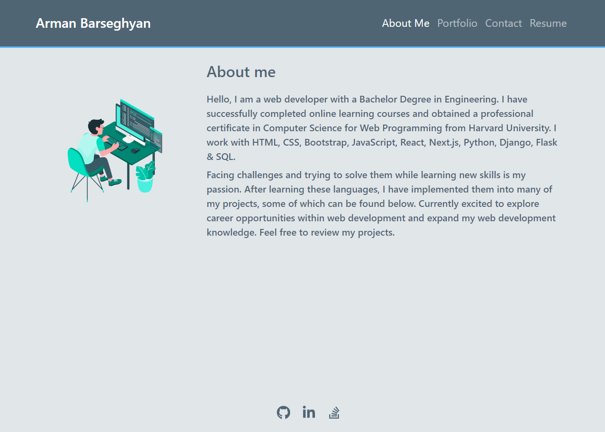
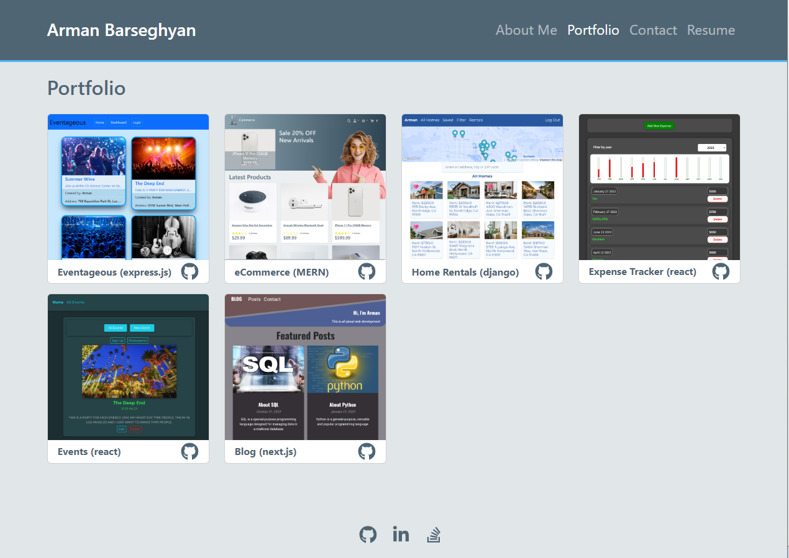
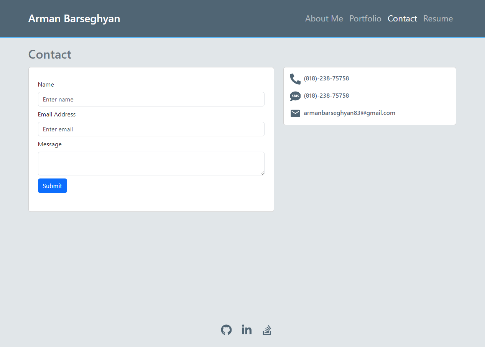
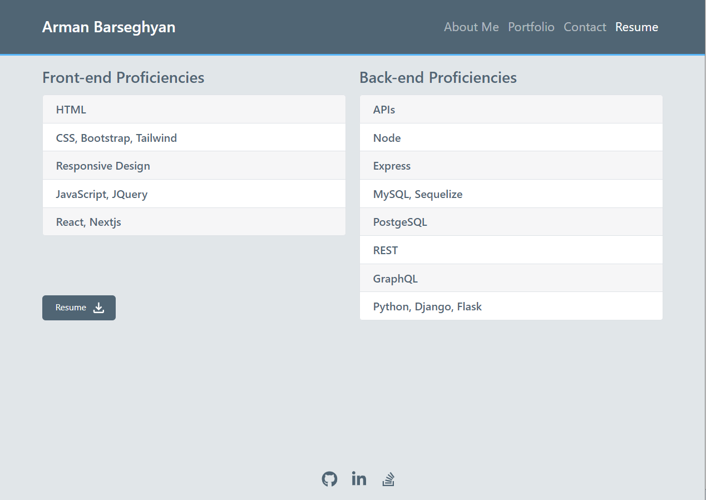

# Portfolio

## Description
This is a website built to showcase my technical skills, web design skills, and projects.

## Technologies Used
- HTML
- CSS
- JavaScript (ES6)
- React
- React Bootstrap
- React Router

## Usage
Use the navbar buttons to navigate between the sections. 

### Go to [Portfolio](https://2portfoli.netlify.app/)

About Me page

Porfolio page

Contact page

Resume page

## Questions
### Use the links below if you have any questions.
- Email Address - [armanbarseghyan83@gmail.com](mailto:armanbarseghyan83@gmail.com)
- Linkedin - [https://www.linkedin.com/in/arman-barseghyan](https://www.linkedin.com/in/arman-barseghyan)
- GitHub Profile - [https://github.com/ArmanBarseghyan83](https://github.com/ArmanBarseghyan83)
